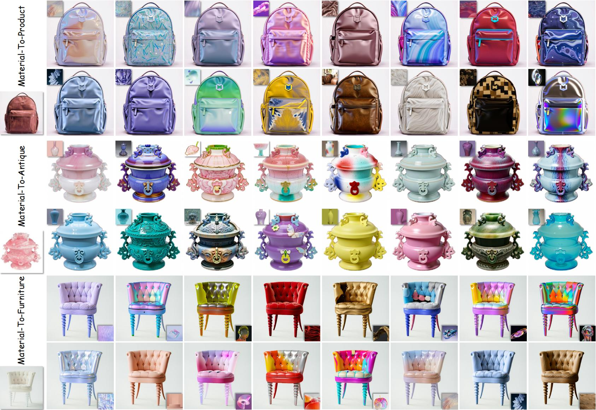

# DealMaTe: Multi-Dimensional Material Transfer via Diffusion Transformer

[](https://dl.acm.org/doi/abs/10.1145/3817061)
[](https://arxiv.org/abs/2605.15681)
[](https://haha-lisa.github.io/DealMaTe/)
[](LICENSE)

<p align="center">
  
</p>

**DealMaTe: Multi-Dimensional Material Transfer via Diffusion Transformer**  
Nisha Huang, Yizhou Lin, Jie Guo, Xiu Li, Tong-Yee Lee, Zitong Yu  
*ACM Transactions on Graphics (TOG), 2026*

---

## Overview

DealMaTe is an efficient, text-free material transfer framework built on the FLUX.1 Diffusion Transformer. Given a **material reference image** and a **target object image**, DealMaTe faithfully transfers the material appearance onto the object while preserving its 3D geometry, lighting, and surface structure.

---

## Installation

```bash
git clone https://github.com/namrakoyani123/DealMaTe.git
cd DealMaTe
pip install -r requirements.txt
```

**Requirements:** Python 3.10+, CUDA 11.8+, ~40 GB GPU VRAM (A100 recommended).

---

## Model Weights

Download the three pre-trained Shader LoRA weights and place them in the `lora/` directory:

| File | Description |
|---|---|
| `lora/depth.safetensors` | Depth LoRA — encodes 3D spatial structure |
| `lora/normal.safetensors` | Normal LoRA — captures surface curvature |
| `lora/lighting.safetensors` | Lighting LoRA — models illumination direction and intensity |

> **Download links:** [Hugging Face](https://huggingface.co/lisalisalisa/DealMaTe)

The pipeline also requires the following base models from Hugging Face (downloaded automatically on first run):
- [`black-forest-labs/FLUX.1-dev`](https://huggingface.co/black-forest-labs/FLUX.1-dev)
- [`black-forest-labs/FLUX.1-Redux-dev`](https://huggingface.co/black-forest-labs/FLUX.1-Redux-dev)

---

## Preparing Inputs

For each target object image you need:
1. **Content image** — the target object photo.
2. **Mask image** — binary mask (white = object region to transfer material onto). Can be obtained with [SAM](https://github.com/facebookresearch/segment-anything).
3. **Depth map** — estimated using [Marigold](https://github.com/prs-eth/Marigold).
4. **Surface normals** — estimated using [Marigold-Normals](https://github.com/prs-eth/Marigold).
5. **Lighting image** — diffuse shading component from [Marigold-IID](https://github.com/prs-eth/Marigold).
6. **Material image** — any real-world or CG material photograph.

Example inputs are provided in `examples/inputs/`.

---

## Inference

```bash
python inference.py \
    --material_path  examples/inputs/material.png \
    --content_path   examples/inputs/content.jpg \
    --mask_path      examples/inputs/mask.png \
    --depth_path     examples/inputs/depth.png \
    --normal_path    examples/inputs/normal.png \
    --lighting_path  examples/inputs/lighting.png \
    --output_path    outputs/result.png \
    --lora_path      ./lora \
    --seed           42
```

The script saves:
- `outputs/result.png` — the final composited result (material transferred onto the object).
- `outputs/result_generated.png` — the raw 1024×1024 generated image before compositing.

---

## Citation

If you find DealMaTe useful in your research, please cite:

```bibtex
@article{huang2026dealmate,
  title     = {DealMaTe: Multi-Dimensional Material Transfer via Diffusion Transformer},
  author    = {Huang, Nisha and Lin, Yizhou and Guo, Jie and Li, Xiu and Lee, Tong-Yee and Yu, Zitong},
  journal   = {ACM Transactions on Graphics},
  year      = {2026},
  publisher = {ACM}
}
```

```bibtex
@inproceedings{huang2025mate,
  title={MaTe: Images Are All You Need for Material Transfer via Diffusion Transformer},
  author={Huang, Nisha and Liu, Henglin and Lin, Yizhou and Huang, Kaer and Chen, Chubin and Guo, Jie and Lee, Tong-yee and Li, Xiu},
  booktitle={Proceedings of the IEEE/CVF International Conference on Computer Vision},
  pages={15117--15126},
  year={2025}
}
```

---

## Acknowledgements

This work builds upon [FLUX.1](https://github.com/black-forest-labs/flux), [EasyControl](https://github.com/Xiaojiu-z/EasyControl), and [Marigold](https://github.com/prs-eth/Marigold). We thank their authors for making their code publicly available.

---

## License

This project is released under the [MIT License](LICENSE). The base FLUX.1 model is subject to its own [license](https://huggingface.co/black-forest-labs/FLUX.1-dev/blob/main/LICENSE.md).
